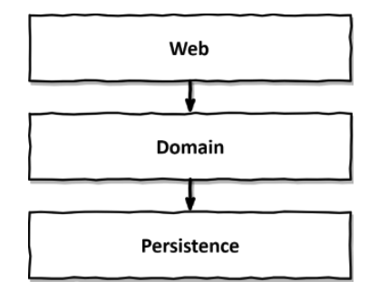

# 1. 계층형 아키텍처의 문제는 무엇일까?

## 계층형 아키텍처 (**[Layered Architecture](https://cs.uwaterloo.ca/~m2nagapp/courses/CS446/1195/Arch_Design_Activity/Layered.pdf)**)!?

<aside>
🔥 일반적인 레이어드 아키텍처의 존재이유는 웹(Presentation) → 도메인(Domain) → 영속성(Persistence) 의 흐름으로 위에서 아래로 데이터가 흐를 수 있도록 각 레이어에 영향을 주지 않고 독립적으로 유지보수 될 수 있도록 함에 있음

</aside>

이 책에서 소개하는 레이어드 아키텍처의 층별 구성은 위 그림과 같다.

하지만 각자 서비스하는 애플리케이션 특성 혹은 문제영역 컨텍스트마다 레이어드 아키텍처의 층별 구조는 각기 다르고 부르는 이름도 조금씩은 다르게 구성하나 넓은 의미의 구성은 같고 어쨌든 데이터의 흐름은 위에서 아래로 흐른다는 사실은 변하지 않는다!

- `웹 Presentation:` 외부로부터의 요청을 받음
    - Controller, Event Listener, System.in, CLI 등 외부로부터 데이터 요청이 최초로 진입하는 곳?
- `도메인 Domain`: 비즈니스 로직을 수행
    - Domain Service
    - Application Service (개인적으로 이곳에 위치하기 조금 애매하다고 생각하지만, 위 그림의 다이어그램에서는 이것까지 퉁치는듯)
    - Domain(Entity, Value Object)
- `영속성 Persistence`: 도메인 엔티티의 현재 상태를 조회, 변경 등 각종 infrastructure의 시스템과의 상호작용
    - Database (RDB, KeyValue 등)
    - File Storage
    - ... 등등 (더 이상 생각하기 귀찮다..)

## 계층형 아키텍처(Layered Architecture)가 주는 장점

- 도메인 로직에 영향을 주지 않고 웹 계층과 영속성 계층에 사용된 기술을 변경할 수 있다. (즉, 신규 기능을 추가할 때 기존 기능에 영향을 주지 않고 작업할 수 있다!)
- **잘** 만들어진 계층형 아키텍처는 선택의 폭을 넓히고, 변화하는 요구사항과 외부 요인에 빠르게 적응할 수 있게 해준다.

<aside>
🔥 계층형 아키텍처(Layered Architecture)는 장점뿐 아니라, 단점들도 존재하는데 저자가 소개하길
- 코드에 나쁜 습관들이 스며들기 쉽게 만들며
- 시간이 지날수록 소프트웨어를 점점 더 변경하기 어렵게 만드는 수많은 허점들을 노출한다

</aside>

## 계층형 아키텍처는 데이터베이스 주도 설계를 유도한다.

전통적인 계층형 아키텍처의 토대는 데이터베이스이다.

왜 데이터베이스가 토대인가?

- 계층형 아키텍처의 각 레이어의 흐름대로 위에서 아래로의 계층에 의존하기 때문에 자연스레 데이터베이스(영속성 계층)에 의존하게 된다.
- 데이터의 상태(state)를 기반으로 애플리케이션을 설계한다.
- ORM 프레임워크를 사용하여 비즈니스 규칙을 영속성 관점과 섞게 된다.
    
    
    
    도메인(Domain) 계층에서 Entity에 접근할 수 있게되고,  이러한 것은 강한 결합을 유발한다. 마치 영속성 레이어에 있는 엔티티 모델을 비즈니스 도메인 모델처럼 사용하게되고 영속성 계층에 관련된 지저분한 코드가 도메인 모델을 오염시킨다.
    

## 지름길을 택하기 쉬워진다

계층형 아키텍처에서 적용되는 유일한 규칙은, 상위계층에서 동일계층 혹은 하위계층으로 접근가능하다는 것이다.

이 규칙을 따라 상위 계층에 위치한 컴포넌트에 접근해야 할 일이 있다면, 택하기 쉬운 지름길로는 **접근해야 할 그 컴포넌트를 하위계층으로 내려버리는 것**이다.

하나 둘 내리다보면.. 결국 최하위계층인 영속성계층에 굳이 어떠한 계층에도 속할 필요없어보이는 `Helper`, `Util` 컴포넌트들이 내려올 가능성이 높다.

<aside>
🔥 지름길을 허용하고 싶지 않다면?

- 해당 규칙(계층형 아키텍처의 유일한 규칙 외의 추가적인 규칙)이 어긋났을 때 빌드가 실패하도록 만드는 자동화 시스템 구축

</aside>

## 테스트하기 어려워진다

또 하나의 단점으로는, 계층형 아키텍처를 사용할 때 **계층을 건너뛰는 경우**이다.

`계층을 건너뛰는 것`?: 웹(Web) 계층에서 영속성(Persistence) 계층 컴포넌트에 접근해야 할 때 도메인 계층을 거치지 않고 건너뛰는 것

웹 계층에서 도메인 계층을 건너뛰어 영속성 계층에 접근하는 모습

위와 같은 상황은 적어도 다음과 같은 두가지 이상의 문제점을 초래한다.

- 이러한 상황은 점진적으로 더 많은 도메인 로직을 웹 계층에 추가해서 애플리케이션 전반에 걸쳐 책임이 섞이고 핵심 도메인 로직들이 분산될 확률이 높다. (즉, 유지보수가 힘들어질 것)
- 웹 계층을 테스트하려고 할 때 도메인 계층뿐만 아니라 그 하위 계층인 영속성 계층도 `mocking`해야 한다
    - 해당 컴포넌트의 테스트를 위한 상호작용 구성요소들의 범위가 넓어진다. (`도메인, 영속성` > `도메인`)
    - 그로 인해 테스트의 복잡성이 증가하고 테스트코드를 작성하는데 시간이 더 걸리게 된다. (테스트 목적의식에 맞는 코드보다 test double, fixture 코드가 더 많아질 것)

## 유스케이스를 숨긴다

<aside>
🔥 잠깐! 유스케이스(`Use case`)가 정확히 뭘까?

마틴파울러는 클린아키텍처에서 이렇게 정의했다.
만들고자하는 시스템(서비스)을 사용하는 클라이언트가 그 시스템을 통해 하고자 하는 것 

”배달의민족” 이라는 서비스가 있다고 했을 때 배달의민족 서비스를 통해 “음식을 주문” 할 수도 있고 “결제” 를 할 수도 있으며 “상품권 선물”등을 할 수도 있을 것이다. 어찌됐건 배달의민족 서비스를 통해 `사용자가 무엇인가 시스템에게 요청할 수 있는 사용사례`(직역)인 것 이다.

</aside>

<aside>
🔥 그래서.. 유스케이스(`Use case`) 라는 개념을 왜 알고있어야 하며, 이것이 우리에게 무슨 도움이 되는가?

어떠한 요청에 의해 사용되는 Entity들은 결국 어떠한 서비스를 통해 시스템이 처리해야 할 사용사례들을 의미하고 이것은 해당 유스케이스를 기반으로 하여 `유스케이스를 이루기 위한 객체들의 협력으로 구성할 수 있을 것`, 즉 유스케이스가 분명하면 유스케이스를 이루기 위한 Entity가 구체화 될 수 있다. 

”배달의 민족” 서비스의 “음식 주문”이라는 유스케이스를 이루기 위한 Entity는 주문(Order), 가게(Shop), 메뉴(Menu) 이 될 수 있을것이다.

</aside>

위 `지름길을 택하기 쉬워진다` 절에서 살펴본 것 처럼 계층형 아키텍처에서는 도메인 로직이 여러 계층에 걸쳐 흩어지기 쉽다.  이 문제는 다음과 같은 문제를 초래하는데..

도메인 계층의 접근을 생략한 채 웹 계층에서 영속성 계층 컴포넌트에 접근하거나, 도메인 계층과 영속성 계층 모두에서 접근할 수 있도록 특정 컴포넌트를 아래로 내린 상황이라면 이미 특정 유스케이스를 구현해야 하는 적당한 위치(컴포넌트, 패키지)를 찾기 어려워진 상태를 의미한다.

즉 아래와 같이 여러개의 유스케이스를 담당하는 넓은 서비스가 만들어지기도 할 것

넓은 서비스는 코드상에서 특정 유스케이스를 찾는 것을 어렵게 만듬

넓은 서비스가 가지는 단점

- 의존성이 많아져 테스트하기 어려워진다.
- 작업해야 할 유스케이스를 책임지는 서비스를 찾기가 어려워진다.

그렇다면 좁은 서비스가 주는 장점은?

- 의존성이 비교적 적어 테스트하기 쉬워진다.
- 작업해야 할 유스케이스를 특정하기 쉬워진다.
    - “사용자 등록” 유스케이스를 구현하기 위한 서비스는 `UserService` 보다는 `RegisterUserService` 라는 서비스가 더 명확할 것

## 동시 작업이 어려워진다

가장 이상적인 상황은 개발해야 할 소프트웨어가 정해진 기간안에 완성이 되는 것일 것

하지만 아주 유명한 저서인 “맨먼스 미신"에 나오는 법칙

> 지체되는 소프트웨어 프로젝트에 인력을 더하는 것은 개발을 늦출 뿐 (브룩스의 법칙)
> 

일반적으로 인력을 쏟아붇는다고 해서 정비례하게 소프트웨어 프로젝트 완성기간이 단축되지는 않을 것

특히나 계층형 아키텍처에서는 더욱이 그러한것이 모든것이 데이터의 상태(state)에 기반하고 결국 영속성 계층을 위해 개발되어지는 아키텍처이기 때문에 영속성 계층이 완성되기 전에는 상위 계층의 작업을 먼저 진행하기 어렵다.

(즉, 소프트웨어 개발자가 계층을 개별적으로 작업하기 어렵다.)

만약 위 `유스케이스를 숨긴다`의 `넓은 서비스`가 있다면 더욱이 서로 다른 기능을 동시에 작업하기는 어려울 것

- 서로 다른 유스케이스에 대한 작업은 동시에 같은 서비스를 동시에 편집하는 상황을 야기하고, 이는 코드 버전관리 merge conflict 를 잠재적으로 이전 코드로 되돌려야 하는 문제를 야기함

## 유지보수 가능한 소프트웨어를 만드는 데 어떻게 도움이 될까?

- 올바르게 구축하고 몇가지 추가적인 규칙들을 적용하면 계층형 아키텍처 또한 유지보수하기 쉬운 아키텍처가 될 수 있다.
- 계층형 아키텍처의 함정을 염두해두고 지름길을 택하지 않으면 오히려 도움이 될 것

# 정리

<aside>
🔥 계층형 아키텍처는 잘 설계한다면 좋은 아키텍처로써 자리잡을 수 있지만, 지름길을 택하기 쉬운 요소들이 많다.

지름길을 최대한 피할 수 있도록 하고, 함정에 빠지지 않게끔 잘 고려한다면 충분히 좋은 설계를 이룰 수 있다.

하지만.. 어렵다!

</aside>
