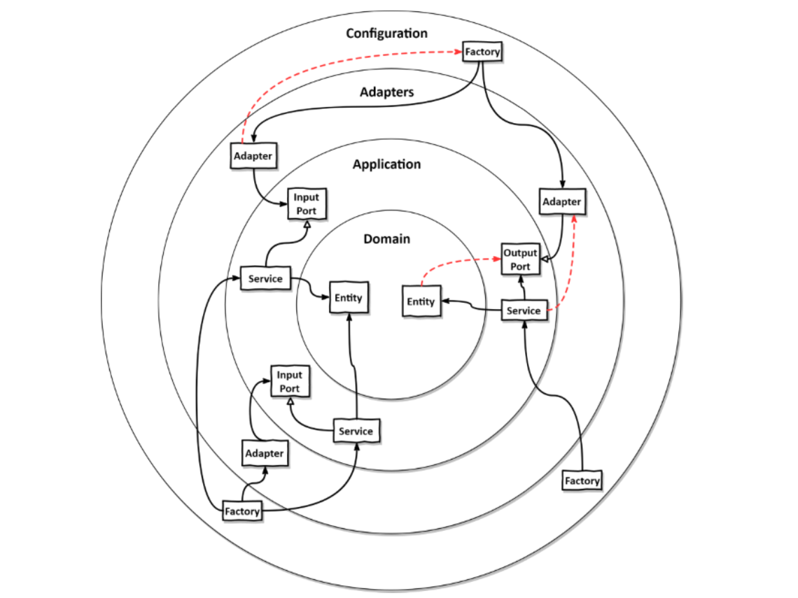

# 10. 아키텍처 경계 강제하기

<aside>
🔥 시간이 지나면서 아키텍처는 계층 간의 경계가 약화되어 무너질것이다. 이를 방지하는 위해 아키텍처 경계를 강제하는 방법들을 알아보기

</aside>

# 경계와 의존성

`아키텍처 경계를 강제`한다는 것은 의존성이 올바른 방향을 향하도록 강제하는 것을 의미한다.



위 그림은 헥사고날 아키텍처의 요소들이 클린아키텍처에서 소개된 4개의 계층에 어떻게 흩어져 있는지 보여준다.

- **도메인 (Domain)**
아키텍처의 가장 내부에 존재하는 영역, 비즈니스 로직이 구현되는 영역
- **애플리케이션 (Application)**
유스케이스 단위로 구현되어 실제 도메인 엔티티에 접근하기 위한 영역
인커밍 포트를 통해 접근하는 영역
- **어댑터 (Adapters)**
아웃고잉 포트를 통해 접근하는 영역
외부 인프라 영역
- **설정 (Configuration)**
어댑터와 서비스 객체를 생성할 팩터리를 포함 및 의존성 주입 메커니즘을 제공

위 그림의 아키텍처 경계는 각 계층 사이, 안쪽 인접 계층과 바깥쪽 계층 사이에 경계가 명확하다. 의존성 규칙에 따라 계층 경계를 넘는 의존성은 항상 안쪽 방향으로 향해야 한다. (단방향)

하지만 빨간색 점선 화살표와 같은 잘못된 방향을 가리키는 의존성을 어떻게 없앨 수 있을까?

- Adapter → Configuration Factory
- Entity → Output Port
- Service → Adapter

# 접근 제한자

<aside>
🔥 접근제한자는 경계를 강제하기 위해 자바에서 제공하는 가장 기본적인 도구로 사용할 수 있다.

</aside>

Java에서는 `public`, `protected`, `private`, `default` 와 같은 접근제한자를 지원하는데, 이 중

`package-private`에 활용할 수 있는 `default` 제한자를 통해 각 패키지 간의 응집적인 모듈을 형성할 수 있다.

- `package-private`
    
    <aside>
    🌟 잠깐! `package-private` 이란? (다시 되새기기)
    
    일반적으로  자바 접근제한자 중 그 어느것도 선언하지 않은 형태인 `default` 접근제한자를 사용하는것을 의미한다.
    
    `default` 접근제한자 사용시 해당 접근제한자가 적용된 대상은 같은 패키지 내에서만 접근할 수 있어 패키지 레벨에서의 `private`함이 보호된다.
    
    </aside>
    

즉, 패키지 별로 응집적인 모듈을 구성하고, 모듈 내에 있는 클래스들은 서로 접근 가능하지만, 모듈 외부에서는 접근하지 못하게 강제 할 수 있다. 

하지만 외부에서 접근해야 할 진입점이 될 클래스들이 필요하므로, 이러한 진입점 클래스들만 `public`으로 공개하여 제공한다.


클래스명 앞에 ‘o’ 표시는  package-private 접근제한자를 사용하고 있다는 의미

`persistence` 패키지에 있는 클래스들은 외부에서 접근할 필요가 없기 때문에(외부에서는 out port로 접근) `package-private` 으로 구성하여 외부에서 접근하지 못하게 강제한다. 

같은 이유로 `SendMoneyService` 또한 `package-private` 으로 구성할 수 있다. (외부에서는 `SendMoneyUseCase`로 접근)

<aside>
🔥 의존성 주입 메커니즘은 일반적으로 리플렉션을 이용해 클래스를 인스턴스로 만들기 때문에 `package-private`으로 구성해도 인스턴스를 만들 수 있다.

</aside>

- 스프링도 역시나 Bean을 등록하기 위해 리플렉션을 사용한다.
    
    `org.springframework.beans.BeanUtils`
    사전에 스프링 IoC 컨테이너에 빈으로 등록하겠다고 애노테이션(`Component`, `Service` 등)을 달아둔 콘크리트 클래스들은 아래처럼 리플렉션 생성자를 통해 인스턴스화 된다.
    
    즉 어떠한 접근제한자를 가진 클래스, 그 클래스의 생성자가 private 접근제한자이더라도 스프링은 리플렉션으로 접근하여 인스턴스화 할 수 있다.
    
    
    

- 하지만 의존성 주입을 직접 관리(DI 프레임워크 없이)해야 한다면, 어쩔수 없이 `public` 접근제한자를 사용해야 한다.
- `package-private` 제한자는 몇 개 정도의 클래스로만 이뤄진 작은 모듈에서 효과적이다.
- 하나의 패키지에 너무 많은 클래스를 포함하는것이 혼란스럽다면, 해당 패키지에 하위 패키지를 만드는 방법을 선호한다.
    - 하지만, 하위 패키지는 상위 패키지의 다른 패키지로 취급되어지기 때문에, 결국 하위 `package-private` 영역에 접근할 수 없게 되어 상위에서 하위에 접근하기 위해 `public`  접근 제한자를 사용해야 하는데, 이는 모든 영역에 노출되는 꼴이 되기 때문에 적합하지 않을 수 있다.

# 컴파일 후 체크

의존성의 방향이 잘못되었는지 판단하기 위해 컴파일 레벨에서 체크할 수 없는 경우가 있다.

- public 제한자를 예외상황상 사용하여, 컴파일러는 이를 알지 못하고 감지하지 못함

위와 같은 경우에 컴파일 후 체크를 도입하여 이를 해결 할 수 있다.

<aside>
🔥 컴파일 후 체크(post-compile check)는 코드가 컴파일 된 후에 런타임에 체크한다는 의미이다.

</aside>

이러한 런타임 체크는 지속적인 통합 빌드 환경에서 자동화된 테스트 과정에서 가장 잘 동작한다.

## ArchUnit

자바의 대표적인 런타임 체크 도구로는 ArchUnit이 있다.

<aside>
🔥 ArchUnit은 의존성 방향이 기대한 대로 잘 설정돼 있는지 체크해줄 수 있는 API들을 제공한다. 만약 의존성 규칙이 위반되어있다면 예외를 던져, 위반사항을 알린다

`JUnit`과 같은 테스트 프레임워크 기반에서 가장 잘 동작하고, 테스트 코드로써 아키텍처의 의존성 규칙 위반 검증 케이스를 작성할 수 있다.

</aside>

도메인 계층이 애플리케이션 계층으로 향하는 의존성이 없는지 검증

```java
class DependencyRuleTests {

    @Test
    void domainLayerDoesNotDependOnApplicationLayer() {
        noClasses()
                .that()
                .resideInAPackage("buckpal.domain..")
                .should()
                .dependOnClassesThat()
                .resideInAnyPackage("buckpal.application..")
                .check(new ClassFileImporter()
                        .importPackages("buckpal.."));
    }
}
```

아래와 같이 ArchUnit이 기본적으로 제공하는 기능을 확장하여 다소 헥사고날 아키텍처 도메인에 특화된 DSL(Domain Specific Language) 형태로 아키텍처 의존성 검증 테스트를 수행할 수 있다.

```java
class DependencyRuleTests {

    @Test
    void validateRegistrationContextArchitecture() {
        HexagonalArchitecture.boundedContext("account")
                .withDomainLayer("domain")
                .withAdaptersLayer("adapter")
	                .incoming("web")
	                .outgoing("persistence")
	                .and()
                .withApplicationLayer("application")
	                .services("service")
	                .incomingPorts("port.in")
	                .outgoingPorts("port.out")
	                .and()
								.withConfiguration("configuration")
								.check(new ClassFileImporter()
                   .importPackages("buckpal.."));
    }
}
```

# 빌드 아티팩트

<aside>
🔥 지금까지 코드 상에서 아키텍처 경계를 구분하는 도구로는 패키지를 사용했지만, 더 넓은 범위로 빌드 아티팩트를 통해 경계를 구분짓고 강제할 수 있다.

`Gradle`, `Maven`과 같은 코드를 빌드할 수 있는 빌드 도구를 사용하여 하나의 패키징한 형태의 애플리케이션 파일을 생성하고, 이러한 빌드 과정에서 경계간 의존성을 체크하고 강제할 수 있다.

</aside>


여러 빌드 아티팩트로 경계를 구성하는 다양한 방법


다음과 같이 3개의 빌드아티팩트로 계층 경계를 구분짓고, 설정 모듈은 전이적인 의존성(DI) 때문에 애플리케이션 모듈에도 접근할 수 있도록 만든다.

- 설정(configuration)
- 어댑터(adapter)
    - 헥사고날 아키텍처 가장 외부 계층의 전체적인 컴포넌트를 갖고 있다. 계층간의 의존성으로는 서로 의존이 엄격하게 금지되어 있지는 않지만(내부에서 외부로 의존하는것이 아니기 때문에), 대부분의 경우 서로 다른 어댑터 또한 격리시켜 유지하는 것이 좋다. (서로 변경의 여파를 받지 않기 위함)
- 애플리케이션(application)

위 문제를 개선한 버전으로 아래와 같이 구성할 수도 있다.


첫번째 계층분리 형태에서 확장된 버전, 어댑터 계층을 각 책임에 맞는 어댑터 계층 두개로 쪼개었다.


애플리케이션에 몰려 있는 컴포넌트들을 한층 더 분리한다. 어댑터는 오직 포트만을 알게하고, 의존성 역전 원칙을 적용하여 단방향으로 의존성 흐름을 유지한다.

더 나아가 아래와 같이 각 모듈들이 더 응집성있고 각 모듈이 각자의 단일책임만을 가지도록 더 분리해볼수도 있다.


incoming, outgoing 포트별로 빌드 아티팩트를 구분하고, 유스케이스 계층과 도메인 게층 또한 분리한다.

위와 같이 도메인이 애플리케이션과 별도로 분리되면 좋은점은 도메인이 서비스에 접근할 수 없게 되고(역방향)

도메인 빌드 아티팩트를 의존해야하는 컴포넌트에서는 단지 도메인 의존성만 간단하게 추가하는것으로 사용할 수 있다.

<aside>
🔥 이와 같이 빌드아티팩트를 통해 아키텍처 경계를 구분하는 것이 주는 장점과 단점은 명확하다.

</aside>

장점

- 빌드 도구를 통해 순환 의존성을 확인할 수 있다. (자바 컴파일러는 순환 의존성이 있어도 경고해주지 않는다. , 스프링 빈은 제외)
- 특정 모듈의 코드를 격리한채로 변경이 가능하다.
    - 다른 모듈을 신경쓰지 않은채로 변경이 필요한 모듈만 변경할 수 있다.
- 모듈 간 의존성이 빌드 스크립트에 분명하게 선언되어 있어, 새로 의존성을 추가하는 일은 의식적으로 파악할 수 있다.

단점

- 빌드 스크립트를 유지보수해야 한다.
