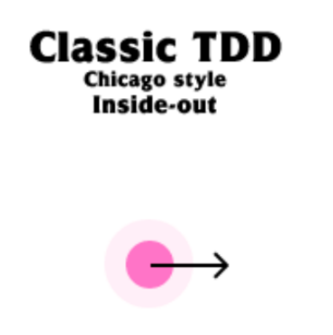

# 4. 유스케이스 구현하기

<aside>
🔥 헥사고날 아키텍처는 각 계층이 아주 느슨하게 결합돼 있기 때문에 필요한 대로 도메인 코드를 자유롭게 모델링 할 수 있음. (즉 도메인을 중심으로 유스케이스를 구현하는게 수월함)

</aside>

# 도메인 모델 구현하기

계좌간 송금 유스케이스 구현

```java
public class Account {
    private AccountId id;
    private Money baselineBalance; // 기준잔고를 표현하는 객체 (Money라는 타입의 객체로 통화값을 표현)
    private ActivityWindow activityWindow; // 입,출금 활동 내역을 기록하는 객체

    // constructors and getters omitted

		// 현재 총 잔고금액은 기준잔고 + 활동내역의 모든 잔고를 합한 값이 된다.
    public Money calculateBalance() {
        return Money.add(
                this.baselineBalance, this.activityWindow.calculateBalance(this.id));
    }

		// 출금 행위는 단순히 활동 내역을 기록하는것으로 비즈니스 로직을 수행한다.
    public boolean withdraw(Money money, AccountId targetAccountId) {
        if (!mayWithdraw(money)) {
            return false;
        }
        Activity withdrawal = new Activity(this.id,
                this.id, targetAccountId, LocalDateTime.now(), money);
        this.activityWindow.addActivity(withdrawal);
        return true;
    }

		// 계좌의 잔고에서 출금금액을 차감해도 -가 되지 않는지 검증
    private boolean mayWithdraw(Money money) {
        return Money.add(
                this.calculateBalance(), money.negate()).isPositive();
    }

		// 입금 행위는 단순히 활동 내역을 기록하는것으로 비즈니스 로직을 수행한다.
    public boolean deposit(Money money, AccountId sourceAccountId) {
        Activity deposit = new Activity(
                this.id, sourceAccountId, this.id, LocalDateTime.now(), money);
        this.activityWindow.addActivity(deposit);
        return true;
    }
}
```

<aside>
🔥 이처럼 어떠한 유스케이스를 구현하기 위한 도메인 엔티티를 정의함으로써 안에서 바깥 방향으로 나아갈 수 있다.

</aside>

번외로 TDD를 구사하는 방법중 아래 두 그림과 같이 Inside-out - Outside-in 방식이 있는데, 헥사고날 아키텍처 기반의 애플리케이션에서 TDD를 진행하면 자연스레 Inside-out 방식으로 구현해나갈 수 있을듯 하다. 

*(물론 아래 TDD 두가지의 방식은 각자의 장단점이 명확하다, 하지만 헥사고날 아키텍처는 애초에 도메인 엔티티를 정의하는것으로 시작하기 때문에 굳이 Outside-in 방식으로 풀어갈 필요는 없을 것 같다.)*



Inside out TDD (도메인부터 구현해나가면서 TDD)


Outside in TDD (외부 사항부터 구현해나가면서 TDD)

# 유스케이스 둘러보기

유스케이스가 실제로 무슨 일을 하는지 살펴봄

**유스케이스는 일반적으로 다음과 같은 단계를 따름**

1. 입력을 받는다
2. 비즈니스 규칙을 검증한다
3. 모델 상태를 조작한다
4. 출력을 반환한다

유스케이스는 인커밍 어댑터로부터 입력받는것에 시작되기 때문에, 마치 입력 유효성 검증(Validate input)을 해야 할 것 같지만,

이는 도메인 영역이 외부(입력) 영역에 오염될 여지를 주는 것으로 입력 유효성 검증(Validate input)은 다른곳에서 처리한다.

유스케이스가 담당해야 할 비즈니스 규칙 검증(Validate business rule)은 입력 유효성 검증(Validate input)과 다르다.  `비즈니스 규칙 검증(Validate business rule) ≠ 입력 유효성 검증(Validate input)`

비즈니스 규칙이 무엇이고, 입력 유효성 검증이 무엇인지에 대한 차이는 아래에서 다시 소개된다.

다시 ‘송금하기’ 유스케이스를 구현하기에 앞서, 앞 장에 소개된 넓은 서비스 문제를 피하기 위한 유스케이스별로 분리된 각각의 서비스를 구현하는 코드를 작성해본다.

```java
package buckpal.application.service;

@RequiredArgsConstructor
@Transactional
public class SendMoneyService implements SendMoneyUseCase {
    private final LoadAccountPort loadAccountPort; // 계좌를 불러오기 위한 아웃고잉 포트 (실제 호출될 구현체는 영속성 영역의 구현체가 주입됌)
    private final AccountLock accountLock; 
    private final UpdateAccountStatePort updateAccountStatePort; // 계좌 상태를 업데이트하기 위한 아웃고잉 포트 (실제 호출될 구현체는 영속성 영역의 구현체가 주입됌)

    @Override
    public boolean sendMoney(SendMoneyCommand command) {
        // TODO: validate business rules
        // TODO: manipulate model state
        // TODO: return output
    }
}
```

다음 그림은 위 유스케이스 서비스가, 어떠한 컴포넌트들과의 상호작용이 이루어지는지 나타낸것이다.


<aside>
❓ incoming port 영역의 인터페이스는 왜 `XXXPort` 라고 명명하지 않을까?

`SendMoneyPort(유스케이스 진입 포트)`  → `SendMoneyUseCase(유스케이스 구현체 서비스)` 이렇게하면 어색하려나?

</aside>

# 입력 유효성 검증

`입력 유효성 검증`은 `비즈니스 규칙 검증`과는 엄밀히 다르기 때문에, 유스케이스에 `입력 유효성 검증` 과 관련된 역할이 포함되면 유스케이스 코드가 오염될 수 있다. 

**`입력 유효성 검증`의 코드를 `유스케이스`쪽에 넣지 않기를 다시 한번 강조**

<aside>
🔥 **그렇다면 입력 유효성 검증은 어디에서 할까?**

입력을 전달하는 어댑터(incoming adapter)가 유스케이스에 입력을 전달하기 전에 입력 유효성을 검증하게 하기

**입력을 전달하기 전에 입력 유효성을 검증한다는 의미는?**
어댑터가 유스케이스에게 입력을 전달하는 과정중에 한다는 의미
하지만 어댑터 자체에서 직접 유효성 검증을 한다는 것은 아님

**그럼 도대체 어디에서 하는게 좋을지? 🤫** 
`입력모델` 객체에서 하자!
입력모델?:  `어댑터가 유스케이스 포트에 전달하는 그 매개변수!` 
*이 책에서 소개하는 ‘송금하기'의 유스케이스 입력모델은  송금하기라는 명령을 내린다라는 것으로 표현된 `SendMoneyCommand` 로 추상화되어 있다~! (도메인 객체 뿐 아니라, 외부 입,출력 모델에 가까운 객체들도 최대한 그 객체자체만으로 표현될 수 있도록 추상화하는건  매우 객체지향스러운 것 같다 🙂)*

</aside>

‘송금하기’ 유스케이스의 입력모델인 `SendMoneyCommand` 에서 `입력 유효성 검증`을 수행하게 한다고 했는데, 다음과 같이 정확히는 **생성자**에서 검증을 수행한다.

물론 생성자라고 꼭 찝어서 소개되었지만, 때에 따라서는 객체의 생성 역할을 담당할 `정적 팩토리 메소드` 라던지 `빌더`와 같은 곳에서도 충분히 가능할 것

```java
package buckpal.application.port.in;

@Getter
public class SendMoneyCommand {
    private final AccountId sourceAccountId;
    private final AccountId targetAccountId;
    private final Money money;

    public SendMoneyCommand(AccountId sourceAccountId,
                            AccountId targetAccountId,
                            Money money) {
        this.sourceAccountId = sourceAccountId;
        this.targetAccountId = targetAccountId;
        this.money = money;

				// 입력 유효성 검증 시작
				// 검증 위배시 Exception을 던지고, 예외처리를 유도한다
        requireNonNull(sourceAccountId);
        requireNonNull(targetAccountId);
        requireNonNull(money);
        requireGreaterThan(money, 0);
				// 입력 유효성 검증 끄읏
    }
}
```

 실제 패키지 구조를 보면, `SendMoneyCommand`는 애플리케이션 계층 incoming port 영역에 위치하고 있다.

```java
├── account
│   ├── adapter
│   │   ├── in
│   │   │   └── web
│   │   │       └── SendMoneyController.java
│   │   └── out
│   │       └── persistence
│   │           ├── AccountJpaEntity.java
│   │           ├── AccountMapper.java
│   │           ├── AccountPersistenceAdapter.java
│   │           ├── ActivityJpaEntity.java
│   │           ├── ActivityRepository.java
│   │           └── SpringDataAccountRepository.java
│   ├── application
│   │   ├── port
│   │   │   ├── in
│   │   │   │   ├── GetAccountBalanceQuery.java
│   │   │   │   ├── **SendMoneyCommand.java**
│   │   │   │   └── **SendMoneyUseCase.java**
│   │   │   └── out
│   │   │       ├── AccountLock.java
│   │   │       ├── LoadAccountPort.java
│   │   │       └── UpdateAccountStatePort.java
│   │   └── service
│   │       ├── GetAccountBalanceService.java
│   │       ├── MoneyTransferProperties.java
│   │       ├── NoOpAccountLock.java
│   │       ├── SendMoneyService.java
│   │       └── ThresholdExceededException.java
│   └── domain
│       ├── Account.java
│       ├── Activity.java
│       ├── ActivityWindow.java
│       └── Money.java
```

<aside>
📌 잠깐!? 입력유효성검증을 하는 코드로 인해 유스케이스가 더럽혀지면 안된다고 하지 않았는가?

유스케이스와 같은 영역에 위치해있을 뿐이지, 유스케이스 자체를 오염시키지는 않는다.

그래도 뭔가.. 찜찜한데.. incoming adapter 쪽으로 옮기면 안되나?
좋지 않은 선택이다. 그렇게 되면 UseCase에서 SendMoneyCommand를 매개변수로 받을 때, 외부 영역에 의존하게 되는 것이므로 내부에서 외부로의 의존성 흐름을 형성하게 된다.

다시 한번 상기해보면, 클린 아키텍처는 외부에서 내부로의 의존성 흐름은 허용해도, 그 반대는 허용하지 않는다.

</aside>

그 외에..

Bean Validation API (`javax.validation`) 를 통해 SelfValidating 하는 방법에 대해 소개하는데, 이 부분은 지극히 선택적인것 같아 생략

- 코드
    
    ```java
    package buckpal.application.port.in;
    
    @Getter
    public class SendMoneyCommand extends SelfValidating<SendMoneyCommand> {
        @NotNull
        private final AccountId sourceAccountId;
        @NotNull
        private final AccountId targetAccountId;
        @NotNull
        private final Money money;
    
        public SendMoneyCommand(AccountId sourceAccountId,
                                AccountId targetAccountId,
                                Money money) {
            this.sourceAccountId = sourceAccountId;
            this.targetAccountId = targetAccountId;
            this.money = money;
            requireGreaterThan(money, 0);
            this.validateSelf();
        }
    }
    ```
    
- ***개인적으로는 오히려 이런 애노테이션 기반의 구현기술 API를 통해 특정 패턴을 적용하는것 보다는 우리의 유스케이스 입력모델에 맞는 입력 유효성 검증을 코드로 직접 표현하는걸 더 선호함***
- 충분한 트레이드오프를 통해 선택적으로 적용하면 될 듯함

# 생성자의 힘

<aside>
🔥 생성자는 강력하다, 앞선 입력 모델 `SendMoneyCommand` 의 생성자는 각 속성을 받아 객체를 생성하는 책임뿐 아니라, 유효성 검증까지 하고 있기 때문에, 런타임에서도 유효하지 않은 입력모델을 생성할 수 없다.

</aside>

현재 SendMoneyCommand에는 3개의 파라미터밖에 없지만, 생성자에 파라미터가 많아진다면?

- `Builder`(빌더)를 고려해볼 수 있다. (저자가 소개하는 방법)
- 입력모델내의 파라미터 또한 객체로 포장해볼 수 있다. (개인적으로 생각하는 방법)
    - 파라미터가 많아졌다는 것은 이 입력모델에서의 역할이 점점 비대해지고 있지는 않는지 검토해보기

저자는 긴 파라미터 리스트로 인해 Builder 패턴 적용시 겪을 수 있는 안좋은 상황들을 설명한다.

Builder 패턴이 주는 장점들

- 생성 파라미터가 많은 객체도 가독성 있게 chaining 방식의 코드로 객체 생성을 할 수 있다.
    
    ```java
    new SendMoneyCommandBuilder()
    	.sourceAccountId(new AccountId(41L))
    	.targetAccountId(new AccountId(42L)) 
    	// ... initialize many other fields 
    	.build();
    ```
    
- 불변성을 확보하면서 동적으로 필요한 속성들을 설정할 수 있다.

Builder 패턴이 주는 단점들

- 빌더를 유지하는것도 유지보수비용이 든다.
    - 원래 객체의 속성변경같은 것을 빌더에도 적용해주어야 한다. (이것을 잊어먹을 수 있다, 물론 `lombok`과 같은 애노테이션 기반의 구현 기술을 적용한 빌더라면 괜찮지 않을까)
    - 컴파일 시점에 이러한 실수들을 캐치하기 쉽지 않다. (생성자였다면 컴파일 시점에 알아챌 수 있었을 것)

# 유스케이스마다 다른 입력 모델

<aside>
🔥 다른 유스케이스에 동일한 입력 모델을 사용하고 싶은 유혹이 생길때가 있는데, 이럴때 어떻게 해야할까?

</aside>

다음 두 유스케이스를 살펴보자.

1. ‘계좌 등록하기' 유스케이스
    1. 계좌를 소유할 소유자 ID 정보가 필요 O
    2. 계좌 ID는 필요 X
2. ‘계좌 정보 업데이트하기' 유스케이스
    1. 계좌를 소유할 소유자 ID 정보가 필요 X
    2. 계좌 ID는 필요 O

두 유스케이스는 거의 동일한 계좌 상세 정보가 필요한데, 그 중에 달라지는 것은 계좌 ID, 소유자 ID 뿐이다.

유스케이스가 각기 다름이 분명한데도 거의 동일한 입력모델이라는 이유만으로 같은 입력모델을 사용했을 때 나타날 수 있는 문제를 다음 코드로 표현해보았다.

```java
// 일단 이름 짓는것부터가 고통이다...
// 등록, 업데이트 두가지의 관심사가 공존하는 입력모델은 어떤 이름이 좋을까?
public class SaveAccountCommand {

	// '계좌등록하기' 유스케이스에서는 accountId가 null
	// '계좌 정보 업데이트하기' 유스케이스에서는 ownerId가 null
	public SaveAccountCommand(AccountId accountId, OwnerId ownerId, ...) {
			// 두가지의 관심사를 가진 입력모델이기 때문에 특정 속성의 예외 케이스를 처리해주기 위한 null 허용
			// 서로 다른 유스케이스의 입력 유효성 검증으로 인한 코드 오염성 감지
	}
}
```

<aside>
🔥 결론

각 유스케이스 전용 입력 모델을 사용하자.
- 물론 각 유스케이스마다 입력모델을 구현해야 하기때문에 비용은 든다.
- 하지만, 위 코드에서 소개되는 문제들을 보완할 수 있다.

</aside>

# 비즈니스 규칙 검증하기

<aside>
🔥 `입력 유효성 검증`은 유스케이스 로직의 일부가 아닌 반면, `비즈니스 규칙 검증`은 분명히 유스케이스 로직의 일부다.

</aside>

## 입력 유효성 검증 VS 비즈니스 규칙 검증

`입력 유효성 검증`, `비즈니스 규칙 검증` 무엇이 다른가?

<aside>
🔥 일단 둘 다 어떠한 규칙 혹은 제약 등을 지키는지 검증하는 과정이다.

</aside>

입력 유효성 검증

- 구문상의 유효성을 검증
- 도메인 모델의 상태를 참조하지 않음 (**해당 기준으로 구분이 될 것**)
- 유스케이스의 맥락에서 의미 없음 (없다기 보다는 비즈니스 규칙 검증에 비해 의미가 떨어진다고 보아도 될듯, 도메인과 관련된것이 아닌, 애플리케이션 인커밍 어댑터 특성에 따라 달라질수도 있고, 도메인 관점이 아닌 애플리케이션이 가지는 특수성과 관련 되어있어보임)

예시) ‘송금하기' 유스케이스의 ‘송금되는 금액은 0보다 커야 한다’라는 규칙은 도메인 모델에 접근하지 않고도 검증될 수 있기에 다음 입력모델에서 구현될 수 있다.

```java
package buckpal.application.port.in;

@Getter
public class SendMoneyCommand {
    private final AccountId sourceAccountId;
    private final AccountId targetAccountId;
    private final Money money;

    public SendMoneyCommand(AccountId sourceAccountId,
                            AccountId targetAccountId,
                            Money money) {
				// ...
        requireGreaterThan(money, 0);
    }
}
```

<aside>
🔥 의문 및 개인적인 생각
위 `입력 유효성 검증` 예시 코드에서는 ‘송금되는 금액은 0보다 커야 한다’ 라는 규칙을 검증하기 위해 `Money`라는 도메인 모델 상태에 접근하지 않는가?

물론 `Money`는 Entity가 아닌 Value Object이긴 하지만, 설령 그렇다 하더라도 도메인 모델의 상태를 참조하지 않느냐에 따라 결정한다고 무조건적으로 볼 수는 없을 것 같다.

또한 누구는 위 전제와 같이 도메인 모델 상태를 참조한다라고 생각하여 해당 검증을 `입력 유효성 검증`이 아닌 `비즈니스 규칙 검증` 이라고 생각하여 입력모델이 아닌 도메인 모델에 구현할 수도 있지 않을까? (나라면 실제로 `Money`가 0보다 큰지를 검증하는 `Money.isGreaterThanZero()` 를 구현하고 이 메소드를 `Account` Entity에서 호출함으로써 검증할 것 같다. (즉 비즈니스 규칙으로 구분) 

**개인적인 생각**
- `Money`라는 객체를 사용하지 않고 원시값(BigDecimal) 혹은 입력모델에서 사용할 수 있는 모델을 따로 정의한다. 물론 입력 유효성 검증이 끝난 뒤에 입력모델을 생성할 때에는 `Money` 라는 도메인 모델로 변환해볼수 있을 것 같다.
- 내가 생각하기에 입력 유효성 검증 은 좀 더 애플리케이션 구현 기술에 특화된것의 검증이라고 생각된다.
    예를 들자면, Web Application의 특성상 HTTP header와 같은 입력을 통해 어떤 유효성 검증을 한다   고 한다면? 이것 또한 애플리케이션 특성에 특화된 입력 유효성 검증 즉 도메인과는 상관없는 입력에 대한 유효성 검증이라고 할 수 있지 않을까?
- 그 외에 다른 방법들을 더 고민 해봐야겠지만, 해당 기준( 도메인 모델의 상태를 참조)으로는 뭔가 합리적 납득이 되지 않는다.

</aside>

비즈니스 규칙 검증

- 유스케이스의 맥락에서 의미 있음
- 도메인 모델의 상태를 참조함

예시) ‘송금하기' 유스케이스의 ‘출금 계좌는 초과 인출되어서는 안 된다’라는 규칙은 도메인 모델을 참조해야 하기 때문에 `비즈니스 규칙 검증` 이고 이는 관련 도메인 엔티티 안에서 구현하는것이 위치적으로도 깔끔하고, 이후 추론하기도 쉽다.

```java
package buckpal.domain;

public class Account {
    //...
    public boolean withdraw(Money money, AccountId targetAccountId) {
        if (!mayWithdraw(money)) {
            return false;
        }
        // ...
    }
}
```

여의치 않다면 다음과 같이 유스케이스 코드에서 도메인 엔티티를 사용하기 전에 할 수도 있다.

```java
@RequiredArgsConstructor
@Transactional 
public class SendMoneyService implements SendMoneyUseCase{
		//...
		@Override
		public boolean sendMoney(SendMoneyCommand command) { 
				requireAccountExists(command.getSourceAccountId()); 
				requireAccountExists(command.getTargetAccountId()); 
				...
		} 
}
```

<aside>
🔥 하지만, 도메인 모델을 어떤 영속성 계층에서 로드하여 상태에 접근한 후 검증하는거라면, 이는 엔티티 내에 비즈니스 규칙 검증을 구현하는것이 좋다.

</aside>

# 풍부한 도메인 모델 vs 빈약한 도메인 모델

## 풍부한 도메인 모델

- 일반적으로 DDD(Domain Driven Design) 철학을 따름
- 엔티티(Entity)에서 가능한 많은 도메인 로직이 구현됌
    - 대부분의 비즈니스 규칙이 도메인 엔티티에 위치하게 됌
    - 엔티티들은 상태를 변경하는 메서드를 제공
    - 비즈니스 규칙에 맞는 유효한 변경만을 허용

## 빈약한 도메인 모델

- 엔티티의 상태를 외부에서 접근하고 변경할 수 있는 접근자 메소드(`getter`, `setter` 등)만을 제공
- 도메인 로직을 직접 엔티티 내부에 가지고 있지 않음
- 유스케이스 클래스에 엔티티의 상태를 변경하거나 조회하는 도메인 로직이 구현
- 영속성 계층에 엔티티를 전달할 책임 또한 유스케이스에 구현

## Domain Model  VS Transaction Script

어떻게보면 아키텍처 패턴의 도메인 모델, 트랜잭션 스크립트의 특성과도 매우 닮아있다고 생각했다.


Domain Model VS Transaction Script

마틴파울러가 제시한 아키텍처 패턴

[https://martinfowler.com/eaaCatalog/domainModel.html](https://martinfowler.com/eaaCatalog/domainModel.html)

[https://martinfowler.com/eaaCatalog/transactionScript.html](https://martinfowler.com/eaaCatalog/transactionScript.html)

## 결론

<aside>
🔥 이것 또한 트레이드오프..

적절히 고민, 타협 후 결정하기!

</aside>

# 유스케이스마다 다른 출력 모델

- 출력또한 입력과 비슷하게 각 유스케이스에 맞게 구체적일수록 좋음
- 호출자에게 꼭 필요한 데이터만 반환하도록 하는게 좋음
    - 비용적인 측면(데이터, 네트워크 총량)
    - 유지보수 측면(공동의 출력모델을 각 호출자에게 제공한다면 공동 출력모델이 수정되면 관련 호출자 모두에게 영향을 끼침)
- 정답은 없으나, 구체적으로 유지하기 위해서는 계속 질문해보자.
    - 이 출력모델의 구성이 이 호출자에게 적당한수준인가?
    - 의심스럽다면 가능한 한 적게 반환
- 도메인 모델을 출력 모델로 사용하고 싶은 욕구를 견디자.
    - 도메인 모델은 출력 사항에 의해 변경되어야 하는 영역이 아니다. (우리의 비즈니스 규칙들이 들어있는 중요한 영역이다)

<aside>
🔥 유스케이스간에 출력 모델 또한 단일 책임 원칙을 적용하여, 유스케이스의 결합을 제거하자

</aside>

# 읽기 전용 유스케이스는 어떨까?

‘UI에 계좌 잔액 표시’의 유스케이스와 같은 것을 유스케이스라고 볼 수 있을까?

- 프로젝트의 맥락에서 이러한 작업이 유스케이스로 분류될수도 있다.
- 하지만 애플리케이션 코어의 관점에서 이 작업은 간단한 데이터 쿼리임
    - 이러한 이유로 프로젝트 맥락에서 유스케이스로 분류되지 않을수도 있음
- 위와 같은 이유로 유스케이스와 구분하기 위해 쿼리로 구현할 수 있음

## 의문, 개인적인 생각

<aside>
❓ 읽기 전용 유스케이스?

굳이 읽기 전용, 쓰기 전용과 같은 유스케이스를 구분해야 할까?

그렇다면 읽기 전용은 무엇인가? 도메인 엔티티의 상태를 변경하지 않고 참조만 하여 읽는다면 이게 읽기 전용인가?

그렇다면 읽기 전용은 유스케이스가 아니라고 보아야 하는가?

- 개인적으로 읽기 전용이라고 하더라도 유스케이스라고 보는게 맞는 것 같다.
- 하지만 아키텍처에서 `Query`와 `Command`를 구분하여 모델을 설계하고 표현(CQRS)하고 싶다면 유스케이스와 쿼리로 구분하는것도 충분히 동의

</aside>

<aside>
📌 유스케이스

유스케이스 정의에 대해 다시 한번 생각해볼 필요가 있을 것 같다.

유스케이스?
- 애플리케이션에 특화된 업무 규칙
- 사용자가 제공해야 하는 입력, 사용자에게 보여줄 출력, 그리고 해당 출력을 생성하기 위한 처리 단계를 기술하는 것
- 사용자와 엔티티 사이의 상호작용을 규정
- 유스케이스만 보고 웹,앱,CLI 기반인지 알 수 없다.
- 엔티티에 비해 저수준이다. (엔티티에 비해 입출력에 가깝기 때문)

</aside>

# 유지보수 가능한 소프트웨어를 만드는 데ㅔ 어떻게 도움이 될까?

입출력 모델을 독립적으로 모델링하면 원치 않는 부수효과를 피할 수 있고, 유지보수 하기 좋은 코드를 만드는 데 큰 도움이 된다.
