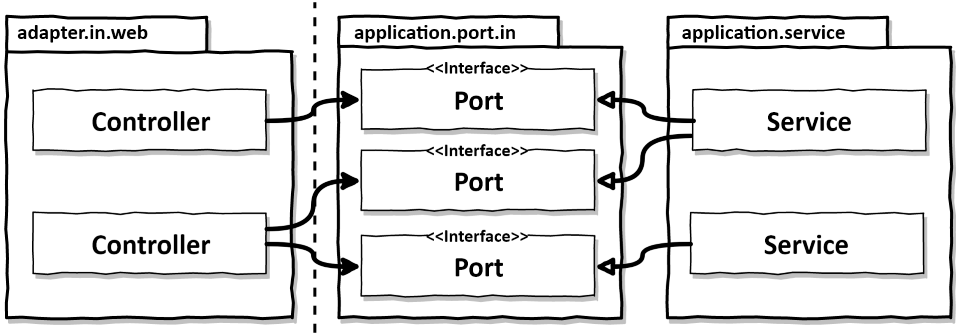

# 05. 웹 어댑터 구현하기

---

- HTTP API처럼 오늘날의 애플리케이션은 대부분 웹 인터페이스 같은 것을 제공함
- 외부 세계와의 커뮤니케이션은 어댑터를 통해 이뤄짐
1. 어댑터의 구현 방법

# 의존성 역전

- 어댑터는 애플리케이션 코어와 상호작용함



- 인커밍 어댑터는 애플리케이션 서비스에 의해 구현된 인터페이스의 전용 포트를 통해 애플리케이션 계층과 통신함

<aside>
💡 웹 어댑터
- 주도하는 혹은 인커임 어댑터
- 외부로부터 요청을 받아 애플리케이션 코어를 호출하고 무엇을 할지 알려줌
- 제어 흐름 : 웹 어댑터(컨트롤러) → 애플리케이션 계층(서비스)

</aside>

- **의존성 역전 원칙**이 적용되어있음
    - 웹 어댑터가 유스케이스 직접 호출 가능
    - 포트 인터페이스를 삭제하고 서비스 직접 호출도 가능
    
    .png)
    
    - 애플리케이션 코어가 외부 세계와 통신할 수 있는 곳에 대한 명세가 포트이기에 인터페이스를 통해야함
        - 외부와 어떤 통신이 일어나는지 바로 확인 가능
- 실시간 데이터를 어떻게 웹 어댑터로 보내고, 웹 어댑터는 이 데이터를 어떻게 사용자의 브라우저로 전송하는가?
    
    .png)
    
    - 반드시 포트가 필요함
    - 애플리케이션이 능동적으로 웹 어댑터에 알림을 준다면 의존성을 올바른 방향으로 유지하기 위해 아웃고잉 포트를 통과해야함
    - 웹 어댑터 ← 인커밍 어댑터 + 아웃고잉 어댑터 (한 어댑터가 두 가지 역할 동시에 가능)

# 웹 어댑터의 책임

- 일반적인 웹 어댑터의 역할
    1. HTTP요청을 자바 객체로 매핑
    2. 권한 검사
    3. 입력 유효성 검증
        1. 유스케이스의 맥락에서의 유효성은 유스케이스의 입력 모델이 검증함
        2. 웹 어댑터의 입력모델은 완전히 다른 유효성 검증
        3. 웹 어댑터의 입력 모델을 유스케이스의 입력 모델로 변환할 수 있음이 검증되어야함
    4. 입력을 유스케이스의 입력 모델로 매핑
    5. 유스케이스 호출
    6. 유스케이스의 출력을 HTTP로 매핑
    7. HTTP응답을 반환
- 바깥에서 들어오는 것들에 대해서는 애플리케이션 계층에 침투해서는 안된다.

# 컨트롤러 나누기

- 웹 어댑터는 한 개 이상의 클래스로도 구성 가능
- 클래스들이 같은 소속임을 나타내기 위해 같은 패키지 수준(hierachy)에 놓아야한다
- 컨트롤러가 너무 적은 것보다는 너무 많은 것이 낫다!

- **REST API를 제공하는 스프링 컨트롤러 예시**
    
    ```java
    package buckpal.adapter.web;
    
    @RestController
    @RequiredArgsConstructor
    class AccountController {
    
    private final GetAccountBalanceQuery getAccountBalanceQuery;
    private final ListAccountsQuery listAccountsQuery;
    private final LoadAccountQuery loadAccountQuery;

    private final SendMoneyUseCase sendMoneyUseCase;
    private final CreateAccountUseCase createAccountUseCase;
    
    @GetMapping("/accounts")
    List<AccountResource> listAccounts(){
    		}
    
    @GetMapping("/accounts/id")
    AccountResource getAccount(@PathVariable("accountId") Long accountId){
     ...
    }
    
    @GetMapping("/accounts/{id}/balance")
    long getAccountBalance(@PathVariable("accountId") Long accountId){
    ...
    }
    
    @PostMapping("/accounts")
    AccountResource createAccount(@RequestBody AccountResource account){
    ...
    }
    
    @PostMapping("/accounts/send/{sourceAccountId}/{targetAccountId}/{amount}")
    void sendMoney(
    @PathVariable("sourceAccountId") Long sourceAccountId,
    @PathVariable("targetAccountId") Long targetAccountId,
    @PathVariable("amount") Long amount) {
    ...
        }
    }
    ```
    
- 클래스마다 코드는 적을수록 좋음
    - 한 클래스에 코드가 너무 많으면 메소드가 아무리 깔끔해도 파악이 어려움
    - 테스트 코드도 컨트롤러 클래스를 따라 증가함
    - 클래스가 작을수록 메소드를 찾기 쉬움

<aside>
💡 단, 모든 연산을 단일 컨트롤러에 넣는 것이 데이터 구조의 재활용의 측면에 있어서 더 좋음
- 하나의 클래스 파일 공유 가능
</aside>

- 연산에 대해 가급적이면 별도의 패키지 안에 별도의 컨트롤러를 만드는 방식 추천
    - 메서드와 클래스명은 유스케이스를 최대한 반영해야함
    - 컨트롤러 예시
        ```java
        @RestController
        @RequiredArgsConstructor
        class SendMoneyController {

            private final SendMoneyUseCase sendMoneyUseCase;

            @PostMapping(path = "/accounts/send/{sourceAccountId}/{targetAccountId}/{amount}")
            void sendMoney(
                    @PathVariable("sourceAccountId") Long sourceAccountId,
                    @PathVariable("targetAccountId") Long targetAccountId,
                    @PathVariable("amount") Long amount) {

                SendMoneyCommand command = new SendMoneyCommand(
                        new AccountId(sourceAccountId),
                        new AccountId(targetAccountId),
                        Money.of(amount));

                sendMoneyUseCase.sendMoney(command);
            }

        }
        ```
        
    - 패키지별 PRIVATE로 선언할 수 있기에 실수로 재사용 되는 일을 막을 수 있음
- 컨트롤러명과 서비스명에 대해서도 명확히할 수 있음
- 나눔으로써 동시 작업이 쉬워짐

# 유지보수 가능한 소프트웨어를 만드는 데 어떻게 도움이 될까?

> 애플리케이션의 웹 어댑터를 구현할 때는 http 요청을 애플리케이션의 유스케이스에 대한 메서드 호출로 변환하고 결괄르 다시 HTTP로 변환하고 어떤 도메인 로직도 수행하지 않는 어댑터를 만들고 있다는 점을 염두에 둬야 한다.
> 

> 애플리케이션 계층은 http에 대한 상세 정보를 노출시키지 않도록 http와 관련된 작업을 해서는 안된다. (필요한 경우 웹 어댑터를 다른 어댑터로 쉽게 교체할 수 있기 때문)
> 
- 모델을 공유하지 않는다면, 작은 클래스들로 나눠서 만들어야함