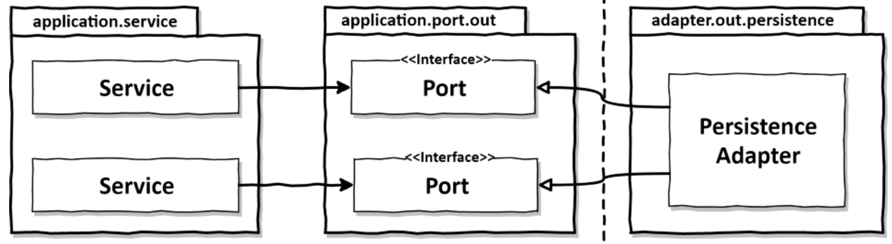
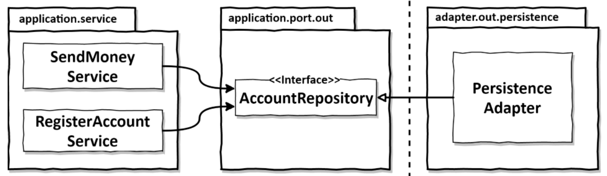
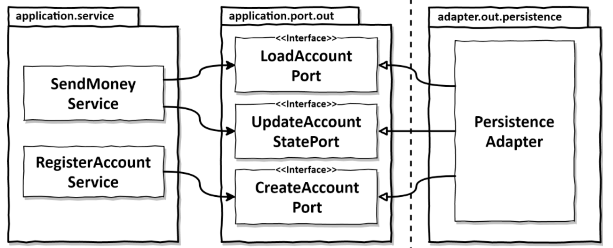
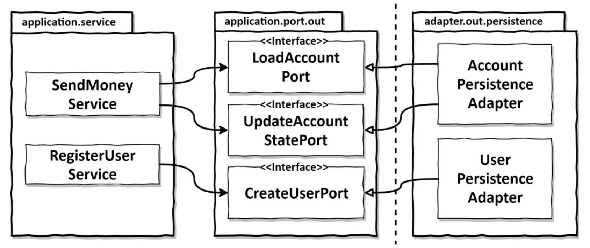
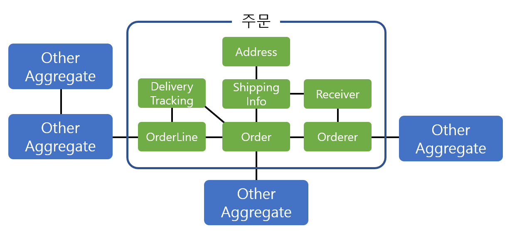
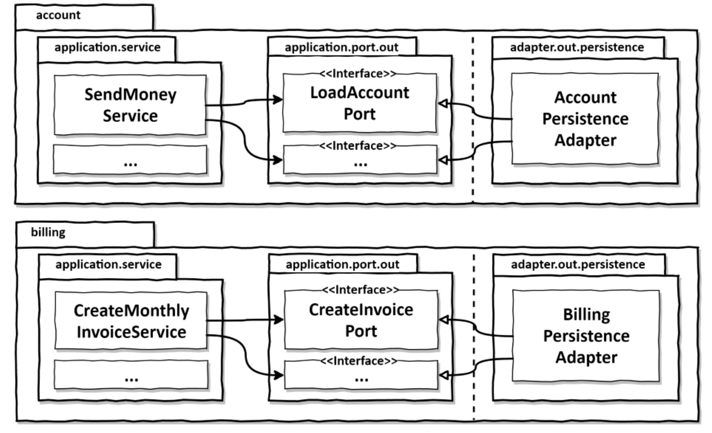

# 6.영속성 어댑터 구현하기

---

## 의존성 역전

---


`애플리케이션 서비스`에서는 영속성 기능을 사용하기 위해 `포트 인터페이스`를 호출한다.

이 포트는 실제로 영속성 작업을 수행하고 데이터베이스와 통신할 책임을 가진 영속성 어댑터 클래스에 의해 구현된다.

<aside>
🔥 육각형 아키텍처 에서 영속성 어댑터는 주도되는 혹은 아웃고잉 어댑터다.

어플리케이션에 의해 호출될 뿐, 어플리케이션을 호출하지 않기 때문.

</aside>

포트는 간접 계층이다. 영속성 계층에 대한 코드 의존성을 없애기 위해 이러한 간접 계층을 추가 한다.

자연스럽게 런타임에도 의존성은 애플리케이션 코어에서 영속성 어댑터로 향한다.

## 영속성 어댑터의 책임

---

### 영속성 어댑터가 하는일

1. 입력을 받는다
2. 입력을 데이터베이스 포맷으로 매핑한다
3. 입력을 데이터베이스로 보낸다
4. 데이터베이스 출력을 어플리케이션 포맷으로 매핑한다
5. 출력을 반환한다

자바 프로젝트에서는 데이터베이스와 통신할 때 일반적으로 `JPA(Java Persistence API)` 를 사용하기 때문에 입력 모델을 데이터베이스 테이블 구조를 반영한 JPA 엔티티로 객체를 매핑할것이다.

JPA 말고 다른 객체-관계 매핑 프레임워크 대신, 데이터베이스와 통신 하기 위해 어떤 기술을 사용해도 상관없다

<aside>
🔥 핵심은 역속성 어댑터의 입력 모델이 영속성 어댑터 내부에 있는것이 아닌 `애플리케이션 코어에 있기 때문`

→ 영속성 어댑터 내부를 변경 하는 것이 코어에 영향을 미치지 않음

</aside>

## 포트와 인터페이스 나누기

---

특정 엔티티가 필요로 하는 모든 데이터베이스 연산을 하나의 리포지토리 인터페이스에서 구현 하는게 일반적



위 그림처럼 구현을 한다면 `넓은 포트 인터페이스`에 의존성을 갖게 된다. 코드에 불필요한 의존성이 생긴다는 뜻

> Depending on something that carries baggage that you don’t need can cause you troubles that you didn’t expect. - Martin C. Robert
> 

`인터페이스 분리 원칙(Interface Segregation Principle, ISP)`은 이 문제의 답을 제시한다.

이 원칙은 클라이언트가 오로지 자신이 필요로 하는 `메서드만 알면 되도록` 넓은 인터페이스를 특화된 이터페이스로 분리 해야 한다.



이제 각 서비스는 실제로 필요한 메서드에만 의존한다. → `포트의 이름이 무슨 기능을 뜻하는지 잘 보임`

테스트에서는 어떤 메서드를 모킹할지 고민할 필요가 없다. 왜냐하면 대부분의 경우 `포트당 하나의 메서드만 있을것이기 때문.`

매우 좁은 포트를 만드는 것은 코딩을 플러그 앤드 플레이(pug-and-play) 경험으로 만든다. 서비스 코드를 짤 때는 필요한 포트에 그저 꽂기만 하면 된다.

## 영속성 어댑터 나누기

---

모든 영속성 포트를 구현 하는 한, 하나 이상의 클래스를 생성 금지 하는 규칙은 없다.



영속성 어댑터를 훨씬 더 많은 클래스로 나눌 수도 있다. 

`애그리거트당 하나`의 영속성 어댑터 접근 방식 또한 나중에 여러 개의 `바운디드 컨텍스트(bounded context)`의 영속성 요구상항을 분리하기 위한 좋은 방법이 된다.

<aside>
🔥 애그리거트??

엔티티 여러개를 하나의 카테고리고 묶는것

`장점`
- 애그리거트를 사용하면 연관 도메인을 묶어서 이해하기 때문에 모델 관계를 파악하기가 더 쉽다.
- 더 잘 이해할 수 있고 애그리거트 단위로 일관성을 관리하면 코드도 일목조연하게 작성할 수 있다.

- 코드의 복잡도가 낮아지기 때문에 유지보수 및 확장, 변경에 들이는 노력이 줄어든다.


</aside>



각 바운디드 컨텍스트는 영속성 어댑터를 하나씩 가지고 있다.

<aside>
🔥 `바운디드 컨텍스트??`

경계를 암시한다
- 모델은 특정한 컨텍스트(문맥)하에서 완전한 의미를 갖는데, 이렇게 구분되는 경계를 갖는 컨텍스트를 `DDD`에서 **BOUNDED CONTEXT**
라고 한다.

</aside>

`account` 맥락의 서비스가 `billing` 맥락의 영속성 어댑터에 접근하지 않고, 반대로 `billing`의 서비스도 `account`의 영속성 어댑터에 접근하지 않는다는 의미

- 어떤 맥락이 다른 맥락에 있는 무언가를 필요로 한다면 `전용 인커밍 포트를 통해 접근` 해야 한다.

## 스프링 데이터 JPA 예제

---

```java
@AllArgsConstructor(access=AccessLevel.PRIVATE)
publicclassAccount{

	@Getter 
	private final AccountId id;

	@Getter 
	private final ActivityWindow activityWindow; 

	private final Money baselineBalance;

	public static Account withoutId( Money baselineBalance,
		ActivityWindow activityWindow) {

			return new Account(null, baselineBalance, activityWindow);
	}
	public static Account withId( AccountId accountId,
          Money baselineBalance, ActivityWindow activityWindow) {

			return new Account(accountId, baselineBalance, activityWindow);
	}

	public Money calculateBalance() { 

		// ...

	}

	public boolean withdraw(Money money, AccountId targetAccountId) { 

		// ...

	}

	public boolean deposit(Money money, AccountId sourceAccountId) { 

		// ...
	
	}

}
```

데이터베이스와의 통신에 `스프링 데이터 JPA`를 사용할 것이므로 계좌의 데이터베이스 상태를 표현하는 `@Entiity`어노테이션이 추가된 클래스도 필요

```java
packagebuckpal.adapter.persistence; 

@Entity
@Table(name="account")
@Data
@AllArgsConstructor
@NoArgsConstructor
classAccountJpaEntity{
	
	@Id
	@GeneratedValue
	private Long id;

}
```

```java
package com.walkhub.walkhub.global.utils.code;

@Entity
@Table(name = "activity")
@Data
@AllArgsConstructor
@NoArgsConstructor
class ActivityJpaEntity {
    
    @Id
    @GeneratedValue
    private Long id;
    
    @Column
    private LocalDateTime timeStamp;
    
    @Column
    private Long ownerAccountId;
    
    @Column
    private Long sourceAccountId;
    
    @Column
    private Long targetAccountId;
    
    @Column
    private Long amount;
}
```

다음으로 기본적인 CRUD 기능과 데이터베이스에서 활동 들을 로드하기 위한 커스텀 쿼리를 제공하는 레포지토리 인터페이스를 생성한다.

```java
interface AccountRepository extends JpaRepository<AccountJpaEntity, Long> {

	@Query("select a from ActivityJpaEntity a " +
      "where a.ownerAccountId = :ownerAccountId " +
      "and a.timestamp >= :since")
  List<ActivityJpaEntity> findByOwnerSince(
      @Param("ownerAccountId") Long ownerAccountId,
      @Param("since") LocalDateTime since);
  @Query("select sum(a.amount) from ActivityJpaEntity a " +
      "where a.targetAccountId = :accountId " +
      "and a.ownerAccountId = :accountId " +
      "and a.timestamp < :until")
  Long getDepositBalanceUntil(
      @Param("accountId") Long accountId,
      @Param("until") LocalDateTime until);
  @Query("select sum(a.amount) from ActivityJpaEntity a " +
      "where a.sourceAccountId = :accountId " +
      "and a.ownerAccountId = :accountId " +
      "and a.timestamp < :until")
  Long getWithdrawalBalanceUntil(
      @Param("accountId") Long accountId,
      @Param("until") LocalDateTime until);

}
```

영속성 어댑터를 만들자!

```java
@RequiredArgsConstructor
@Component
class AccountPersistenceAdapter implements
        LoadAccountPort,
        UpdateAccountStatePort {
    
    private final AccountRepository accountRepository;
    private final ActivityRepository activityRepository;
    private final AccountMapper accountMapper;

    @Override
    public Account loadAccount(AccountId accountId,
                               LocalDateTime baselineDate) {
        AccountJpaEntity account =
                accountRepository.findById(accountId.getValue())
                        .orElseThrow(EntityNotFoundException::new);
        
        List<ActivityJpaEntity> activities =
                activityRepository.findByOwnerSince(
                        accountId.getValue(),
                        baselineDate);
        
        Long withdrawalBalance = orZero(activityRepository
                .getWithdrawalBalanceUntil(
                        accountId.getValue(),
                        baselineDate));
        
        Long depositBalance = orZero(activityRepository
                .getDepositBalanceUntil(
                        accountId.getValue(),
                        baselineDate));
        
        return accountMapper.mapToDomainEntity(account,
                activities,
                withdrawalBalance,
                depositBalance);
    }

		private Long orZero(Long value){
			return value == null ? 0L : value; 
		}

	@Override
    public void updateActivities(Account account) {
        for (Activity activity : account.getActivityWindow().getActivities()) {
            
            if (activity.getId() == null) { 
                activityRepository.save(accountMapper.mapToJpaEntity(activity));
            } 
        }
    }
}
```

영속성 어댑터는 애플리케이션에 필요한 `LoadAccountPort`와 `UpdateAccountStatePort`라는 2개의 포트를 구현

양속성 측면과의 타협 없이 풍부한 도메인 모델을 생성하고 싶다면 도메인 모델과 영속성 모델을 매핑하는 것이 좋다.

## 데이터베이스 트랜잭션은 어떻게 해야 할까?

---

트랜잭션은 하나의 특정한 유스케이스에 대해서 일어나는 모든 쓰기 작업에 걸쳐 있어야 한다.

스프링에서 제일 쉬는 방법은 `@Transactional` 패키지에다가 감싸는것.

아니면 `AspectJ` 같은 도구를 이용해 관점 지향 프로그래밍으로 트랜잭션 경계를 코드에 `위빙(Weavinb)`할 수 있다.

## 유지보수 가능한 소프트웨어를 만든는 데 어떻게 도움이 될까?

---

- 기존의 도메인 계층과 영속성/UI 계층간의 의존성을 역전시킨다.
- 도메인 계층(애플리케이션의 주요 코드)은 다른 컴포넌트를 의존하지 않게 된다.
- SRP 원칙에 의해 도메인 계층은 변경할 이유가 적어진다.
- 각 계층은 더 자유롭게 모델링될 수 있고, 유지보수성이 좋아진다.

> 요약 : 그냥 다 쪼개는게 짱이다
>