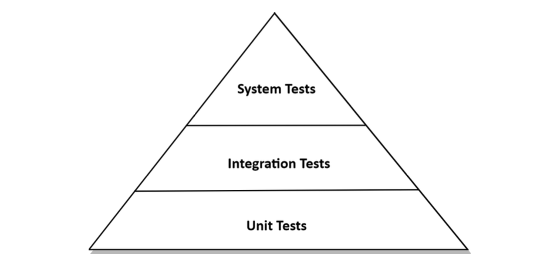

# 7. 아키텍처 요소 테스트하기

<aside>
📌 헥사고날 아키텍처에서의 테스트 전략에 대해 알아보기

</aside>

# 테스트 피라미드



비용이 많이 드는 테스트는 지양하고 비용이 적게 드는 테스트를 많이 만들자!


피라미드 위로 올라갈수록 테스트를 작성/실행 하는데에 시간과 비용이 더 많이 소요됌

좋은 아키텍처가 되기 위한 기본 전제는 만드는 비용이 적고, 유지보수하기 쉬우며 안정적인 작은 크기의 테스트들에 대해 높은 커버리지를 유지하는 것

일반적으로 이런 테스트는 하나의 단위가 제대로 동작할 수 있는 단위 테스트를 의미한다.

<aside>
🔥 하나의 단위가 제대로 동작할 수 있는 테스트가 아닌 테스트들이 많다면?

우리의 아키텍처는 유지보수하기 어려워질것이다. (테스트를 만드는데 시간을 더 쓰게 될수도 있음)

</aside>

프로젝트 맥락에 따라 달라질 수 있지만, 위에서 소개한 테스트 피라미드(왼쪽)에 대한 계층을 다음과 같이 분류한다.

- **단위테스트**: 하나의 클래스를 인스턴스화하고 해당 클래스의 인터페이스를 통해 기능을 테스트한다.
- **통합테스트**: 연결된 여러 유닛을 인스턴스화하고 시작점이되는 클래스의 인터페이스로 데이터를 보낸 후 유닛들의 네트워크가 기대한대로 잘 동작하는지 검증한다.
- **시스템테스트**: 애플리케이션을 구성하는 모든 객체 네트워크를 가동시켜 특정 유스케이스가 전 계층에서 동작하는지 검증한다.

# 단위 테스트로 도메인 엔티티 테스트하기


4장 ‘송금하기' 유스케이스에서 사용했던 `Account` 엔티티의 `withDraw()` 가 기대한 대로 동작하는 검증하는 예시 테스트코드

```java
class AccountTest {

    @Test
    void withdrawalSucceeds() {
				// given
        AccountId accountId = new AccountId(1L);
				
				// 테스트 대상 엔티티의 특정 상태를 가진 객체로 인스턴스화
        Account account = defaultAccount() 
                .withAccountId(accountId)
                .withBaselineBalance(Money.of(555L))
                .withActivityWindow(new ActivityWindow(
                        defaultActivity()
                                .withTargetAccount(accountId)
                                .withMoney(Money.of(999L)).build(),
                        defaultActivity()
                                .withTargetAccount(accountId)
                                .withMoney(Money.of(1L)).build()))
                .build();
				
				// when
				// 관심대상 기능을 테스트하기 위해 호출
        boolean success = account.withdraw(Money.of(555L), new AccountId(99L));
				
				// then
				// 엔티티에 기대하는 상태를 검증
        assertThat(success).isTrue();
        assertThat(account.getActivityWindow().getActivities()).hasSize(3);
        assertThat(account.calculateBalance()).isEqualTo(Money.of(1000L));
    }
}
```

- 위 단위테스트는 다른 계층의 테스트보다 비교적 간단하다.
- 도메인 엔티티에 녹아 있는 비즈니스 규칙을 검증하기에 가장 적절하다.
    - 요걸 하려면 풍부한 도메인 모델이어야 할 듯!?
- 도메인 엔티티는 다른 클래스에 거의 의존하지 않고 있기 때문에 다른 종류의 테스트는 필요하지 않다. (즉 의존이 많을수록 단위 테스트하기 어려워진다~!)

# 단위 테스트로 유스케이스 테스트하기

엔티티 계층 바깥쪽으로 나가 테스트할 요소는 유스케이스다. 


이 역시 4장 ‘송금하기' 유스케이스를 구현하는 `SendMoneyService` 를 대상으로 테스트를 작성

- `SendMoneyService` 프로덕션 코드
    
    ```java
    @RequiredArgsConstructor
    @UseCase
    @Transactional
    public class SendMoneyService implements SendMoneyUseCase {
    
    	private final LoadAccountPort loadAccountPort;
    	private final AccountLock accountLock;
    	private final UpdateAccountStatePort updateAccountStatePort;
    	private final MoneyTransferProperties moneyTransferProperties;
    
    	@Override
    	public boolean sendMoney(SendMoneyCommand command) {
    
    		checkThreshold(command);
    
    		LocalDateTime baselineDate = LocalDateTime.now().minusDays(10);
    
    		Account sourceAccount = loadAccountPort.loadAccount(
    				command.getSourceAccountId(),
    				baselineDate);
    
    		Account targetAccount = loadAccountPort.loadAccount(
    				command.getTargetAccountId(),
    				baselineDate);
    
    		AccountId sourceAccountId = sourceAccount.getId()
    				.orElseThrow(() -> new IllegalStateException("expected source account ID not to be empty"));
    		AccountId targetAccountId = targetAccount.getId()
    				.orElseThrow(() -> new IllegalStateException("expected target account ID not to be empty"));
    
    		accountLock.lockAccount(sourceAccountId);
    		if (!sourceAccount.withdraw(command.getMoney(), targetAccountId)) {
    			accountLock.releaseAccount(sourceAccountId);
    			return false;
    		}
    
    		accountLock.lockAccount(targetAccountId);
    		if (!targetAccount.deposit(command.getMoney(), sourceAccountId)) {
    			accountLock.releaseAccount(sourceAccountId);
    			accountLock.releaseAccount(targetAccountId);
    			return false;
    		}
    
    		updateAccountStatePort.updateActivities(sourceAccount);
    		updateAccountStatePort.updateActivities(targetAccount);
    
    		accountLock.releaseAccount(sourceAccountId);
    		accountLock.releaseAccount(targetAccountId);
    		return true;
    	}
    
    	private void checkThreshold(SendMoneyCommand command) {
    		if(command.getMoney().isGreaterThan(moneyTransferProperties.getMaximumTransferThreshold())){
    			throw new ThresholdExceededException(moneyTransferProperties.getMaximumTransferThreshold(), command.getMoney());
    		}
    	}
    
    }
    ```
    

```java
class SendMoneyServiceTest {

    // declaration of fields omitted

    @Test
    void transactionSucceeds() {
				
				// given
        Account sourceAccount = givenSourceAccount();
        Account targetAccount = givenTargetAccount();

        givenWithdrawalWillSucceed(sourceAccount);
        givenDepositWillSucceed(targetAccount);

        Money money = Money.of(500L);

        SendMoneyCommand command = new SendMoneyCommand(sourceAccount.getId(), targetAccount.getId(),
                money);
				
				// when
        boolean success = sendMoneyService.sendMoney(command);
				
				// then
        assertThat(success).isTrue();

        AccountId sourceAccountId = sourceAccount.getId();
        AccountId targetAccountId = targetAccount.getId();

        then(accountLock).should().lockAccount(eq(sourceAccountId));
        then(sourceAccount).should().withdraw(eq(money), eq(targetAccountId));
        then(accountLock).should().releaseAccount(eq(sourceAccountId));

        then(accountLock).should().lockAccount(eq(targetAccountId));
        then(targetAccount).should().deposit(eq(money), eq(sourceAccountId));
        then(accountLock).should().releaseAccount(eq(targetAccountId));

        thenAccountsHaveBeenUpdated(sourceAccountId, targetAccountId);
    }
    // helper methods omitted
}
```

- 테스트 중인 유스케이스 서비스는 상태가 없는 무상태의 객체이기때문에 then 섹션에서 특정 상태를 검증할 수 없다.
    - 대신 테스트는 모킹된 의존 대상의 상호 작용 여부를 검증한다. (메소드는 몇번 호출되었는가? 어떤 매개변수를 받아 실행되었는가? 등, Test Spy)
- 테스트가 코드의 행동 변경뿐만 아니라 코드의 구조 변경에도 취약해진다.
    - 프로덕션 코드가 변경되면 테스트코드도 변경될 여지가 있음
    Why? 테스트에 필요한 상호 작용 대상들(AccountLock)을 검증하기 때문에 실제 프로덕션 코드에 상호 작용 대상이 변경되면 그것에 맞게 테스트코드도 변경해야 함

<aside>
🔥 얼핏보면 통합테스트에 가까워보이지만, 이는 엄밀히는 단위테스트다

테스트의 의존대상들은 모킹하고, 실제 의존성을 관리하는 것은 아니기 때문에 완전한 통합테스트에 비해 테스트를 작성하고 실행하기 쉽다.

즉, 위와 같은 유스케이스 테스트는 통합테스트에 가까운 단위테스트다

</aside>

# 통합 테스트로 웹 어댑터 테스트하기


웹 어댑터가 가지는 특정 기능을 검증하기 위해 다음과 같이 통합테스트를 작성한다.

테스트 되어야 할 요소

- HTTP 프로토콜을 통해 입력
- 입력에 대한 입력 유효성 검증
- 입력모델을 커맨드로 변환하여 유스케이스에게 전달
- 하여 유스케이스의 결과 출력모델을 반환하여 HTTP 프로토콜을 통해 출력

이 예시에서는 스프링 부트 프레임워크에서 웹 컨트롤러를 테스트하는 표준적인 통합 테스트 방법을 소개한다.

```java
@WebMvcTest(controllers = SendMoneyController.class)
class SendMoneyControllerTest {
    @Autowired
    private MockMvc mockMvc;
    @MockBean
    private SendMoneyUseCase sendMoneyUseCase;

    @Test
    void testSendMoney() throws Exception {
				
				// HTTP를 모사하는 mockMvc를 통해 HTTP 입력 모델을 어댑터에 전달
				// 기대하는 HTTP 응답의 상태가 출력되는지 검증
        mockMvc.perform(
                        post("/accounts/sendMoney/{sourceAccountId}/{targetAccountId}/{amount}",
                                41L, 42L, 500)
                                .header("Content-Type", "application/json"))
                .andExpect(status().isOk());
				
				// 모사된 mockMvc을 통해 HTTP 입력모델이 
				// 웹어댑터에 의해 유스케이스에서 사용될 커맨드로 잘 변환되고 전달되었는지 검증
        then(sendMoneyUseCase).should().sendMoney(eq(new SendMoneyCommand(
                new AccountId(41L), new AccountId(42L), Money.of(500L))));
    }
}
```

<aside>
🔥 MockMvc 객체를 모킹했기 때문에 실제 HTTP 프로토콜까지 테스트한 것은 아니다.

프레임워크가 HTTP 프로토콜에 맞게 모든 것을 적절히 잘 변환한다고 믿는 것이다

</aside>

[RestAssured](https://rest-assured.io/)를 통해 실제 HTTP 프로토콜을 테스트 해볼 수 있다. (물론 이 테스트는 시스템 테스트에 가까울 것)

```java

	RestAssured
    .given().log().all()
    .body(params)
    .contentType(MediaType.APPLICATION_JSON_VALUE)
    .when().post("/accounts/sendMoney/{sourceAccountId}/{targetAccountId}/{amount}")
    .then().log().all().extract()
```

이 테스트가 단위테스트가 아닌 통합테스트인 이유

- `@WebMvcTest` 와 같은 애노테이션이 보이지 않는 곳에서 더 많은 일을 해주고, 이는 전체 객체 네트워크(각 유닛들)를 인스턴스화 하도록 만든다.
- 이 테스트는 웹 컨트롤러가 이(유닛들) 네트워크의 일부로서 잘 동작하는지 검증한다.

이 테스트를 통합테스트가 아닌 단위테스트로 하는 것은 어떨까?

- 웹 컨트롤러는 스프링 프레임워크라는 구현기술에 강하게 결합되어있기 때문에 격리된 상태로 테스트하기 어렵다. (HTTP 매핑 등)
    - 이는 HTTP등 어댑터와 상호작용 할 구현 기술 항목에 대한 커버리지를 낮추게 된다.
- 프레임워크와 통합된 상태로 테스트하는것이 합리적

# 통합 테스트로 영속성 어댑터 테스트하기


영속성 어댑터 또한 웹 어댑터와 마찬가지로 단위 테스트보다는 통합 테스트를 적용하는 것이 합리적이다.

Why?: 웹어댑터와 마찬가지로 구현기술(데이터베이스 매핑)에 강하게 결합되어 있기 때문에, 격리된 상태로 테스트하기 어려움

아래의 테스트코드 예시는 스프링 프레임워크에 특화된 데이터베이스 접근에 필요한 객체 네트워크들을 인스턴스화 해준다.

```java
@DataJpaTest
@Import({AccountPersistenceAdapter.class, AccountMapper.class})
class AccountPersistenceAdapterTest {

    @Autowired
    private AccountPersistenceAdapter adapterUnderTest;
    @Autowired
    private ActivityRepository activityRepository;

		// sql 스크립트를 이용해 데이터베이스에 특정 상태의 데이터를 영속화 한 후 엔티티로 로드하여 검증
		// Database -> Entity
    @Test
    @Sql("AccountPersistenceAdapterTest.sql")
    void loadsAccount() {
        Account account = adapter.loadAccount(new AccountId(1L), LocalDateTime.of(2018, 8, 10, 0, 0));
        assertThat(account.getActivityWindow().getActivities()).hasSize(2);
        assertThat(account.calculateBalance()).isEqualTo(Money.of(500));
    }

		// 엔티티 객체를 기반으로 영속화
		// Entity -> Database
    @Test
    void updatesActivities() {
        Account account = defaultAccount()
                .withBaselineBalance(Money.of(555L)).withActivityWindow(new ActivityWindow(
                        defaultActivity().withId(null)
                                .withMoney(Money.of(1L)).build()))
                .build();
        adapter.updateActivities(account);
        assertThat(activityRepository.count()).isEqualTo(1);
        ActivityJpaEntity savedActivity = activityRepository.findAll().get(0);
        assertThat(savedActivity.getAmount()).isEqualTo(1L);
    }
}
```

위 테스트코드에서 어댑터는 데이터베이스를 모킹하지 않는다. (실제 데이터베이스에 접근한다.)

- 하지만 스프링 프레임워크는 기본적으로 인메모리(H2와 같이 테스트 실행시 메모리 레벨에서 영속성이 적용되는) 데이터베이스를 사용하도록 되어있다. (***어떻게보면 이걸로 Stub(Fake Test Double) 했다고 볼 수 있을 것 같다.***)

<aside>
🔥 H2와 같은 인메모리 데이터베이스로 통합테스트를 작성하면 실제 프로덕션 코드를 정말 커버할 수 있을까?

No, 데이터베이스마다 고유한 SQL문법, 특정 기능들이 다를수도 있기 때문에 테스트를 모두 커버하더라도 실제 프로덕션 코드에서는 오류가 발생할 가능성이 있다.

프로덕션 환경과 최대한 유사하게 테스트를 구현하면 오류를 테스트에서 사전에 감지할 수 있을 것

</aside>

프로덕션에서 사용하는 RDBMS를 그대로 테스트하고 싶다면 어떻게 할 수 있을까?

1. Testcontainers 사용하여 테스트마다 컨테이너를 띄우고 내림
    
    ```java
    
    @DataJpaTest
    @Import({AccountPersistenceAdapter.class, AccountMapper.class})
    @Testcontainers
    class AccountPersistenceAdapterTest {
    
        @Autowired
        private AccountPersistenceAdapter adapterUnderTest;
        @Autowired
        private ActivityRepository activityRepository;
    
    		@Container
    		private static MySQLContainer mysqlContainer = new MySQLContainer("mysql:8")
    
    		// sql 스크립트를 이용해 데이터베이스에 특정 상태의 데이터를 영속화 한 후 엔티티로 로드하여 검증
    		// Database -> Entity
        @Test
        @Sql("AccountPersistenceAdapterTest.sql")
        void loadsAccount() {
            Account account = adapter.loadAccount(new AccountId(1L), LocalDateTime.of(2018, 8, 10, 0, 0));
            assertThat(account.getActivityWindow().getActivities()).hasSize(2);
            assertThat(account.calculateBalance()).isEqualTo(Money.of(500));
        }
    
    		// 엔티티 객체를 기반으로 영속화
    		// Entity -> Database
        @Test
        void updatesActivities() {
            Account account = defaultAccount()
                    .withBaselineBalance(Money.of(555L)).withActivityWindow(new ActivityWindow(
                            defaultActivity().withId(null)
                                    .withMoney(Money.of(1L)).build()))
                    .build();
            adapter.updateActivities(account);
            assertThat(activityRepository.count()).isEqualTo(1);
            ActivityJpaEntity savedActivity = activityRepository.findAll().get(0);
            assertThat(savedActivity.getAmount()).isEqualTo(1L);
        }
    }
    ```
    
2. Local Docker container 사용 (CI에서는 Docker In Docker로 컨테이너 띄워서 테스트)
3. 실제 Local에 MySQL 환경 사용

위 1,2 번은 Docker라는 기술에 대한 의존이 생길수밖에 없다. 하지만 확장성,이식성을 고려했을땐 훨씬 유연할 것

위와같은 사례로 DB뿐만 아니라, AWS와 같은 어댑터와 상호작용 할 인프라스트럭쳐도 실제 환경과 최대한 비슷하게 설정할 수 있는 `LocalStack` 을 예로 들어볼 수 있을 것 같다. (S3, DynamoDB, SQS 의 상호작용을 어떻게 최대한 잘 모사할것인가?)

# 시스템 테스트로 주요 경로 테스트하기


시스템 테스트는 전체 애플리케이션을 동작시켜 API를 통해 요청을 보내고, 모든 계층이 잘 상호작용되는지 검증한다.

역시나 예시코드에는 애플리케이션이 스프링프레임워크에 강하게 결합되어있기때문에 모든 계층의 객체 네트워크를 활성화 시킬 수 있도록 `@SpringBootTest` 와 같은 애노테이션으로 실제 스프링 프레임워크를 동작시킨다.(IoC Container를 활성화)

웹 어댑터 통합테스트에서 사용했던 `MockMvc`를 이용해 HTTP 프로토콜을 모사하는것이 아닌, 실제 프로덕션 환경에 가깝게 요청을 보낼 수 있도록 `TestRestTemplate`을 활용한다.

```java
@SpringBootTest(webEnvironment = WebEnvironment.RANDOM_PORT)
class SendMoneySystemTest {

    @Autowired
    private TestRestTemplate restTemplate;

    @Test
    @Sql("SendMoneySystemTest.sql")
    void sendMoney() {

        Money initialSourceBalance = sourceAccount().calculateBalance();
        Money initialTargetBalance = targetAccount().calculateBalance();

        ResponseEntity response = whenSendMoney(
                sourceAccountId(),
                targetAccountId(),
                transferredAmount());

        then(response.getStatusCode())
                .isEqualTo(HttpStatus.OK);

        then(sourceAccount().calculateBalance())
                .isEqualTo(initialSourceBalance.minus(transferredAmount()));

        then(targetAccount().calculateBalance())
                .isEqualTo(initialTargetBalance.plus(transferredAmount()));
    }

    private ResponseEntity whenSendMoney(AccountId sourceAccountId, AccountId targetAccountId,
                                         Money amount) {
        HttpHeaders headers = new HttpHeaders();
        headers.add("Content-Type", "application/json");
        HttpEntity<Void> request = new HttpEntity<>(null, headers);

        return restTemplate.exchange("/accounts/sendMoney/{sourceAccountId}/{targetAccountId}/{amount}", HttpMethod.POST,
                request,
                Object.class,
                sourceAccountId.getValue(),
                targetAccountId.getValue(),
                amount.getAmount());
    }
    // some helper methods omitted
}
```

<aside>
🔥 실제 HTTP 통신을 하는 것처럼 실제 출력 어댑터도 이용한다. 이 예제에서는 출력 어댑터는 영속성 어댑터 뿐인데,

다른 시스템과 통신하는 애플리케이션의 경우 다른 출력 어댑터가 있을 수 있다.

시스템 테스트라고 하더라도 언제나 서드파티 시스템을 실행해서 테스트할 수 있는 것은 아니기 때문에 결국 모킹을 사용해야 할 때도 있다. 하지만 `**[1]**` **헥사고날 아키텍처는 이 경우 몇개의 출력 포트 인터페이스만 모킹해주면 되기 때문에 보다 쉽게 이 문제를 해결할 수 있다.**

</aside>

- `**[1]` 예시**
    
    
    
    위 `TossClientAdapter`, `KaKaoPayClientAdapter` 의 서드파티 시스템을 실제로 사용할 수 없더라도 `PayClientPort` 만 모킹해주면 된다.
    

<aside>
🔥 내부 계층에서 단위테스트와 통합테스트가 작성되었다면, 시스템 테스트가 커버하는 코드와 겹치는 부분이 많을 것이다.

그럼에도 장점이 있을까?

- 시스템 테스트를 통해서 단위 테스트와 통합테스트가 발견하는 버그와는 또 다른 종류의 버그를 발견할 수도 있다.
ex) 계층간 매핑 버그
- 여러개의 유스케이스를 결합해 하나의 시나리오를 만들 때 빛을 발한다. 시스템 테스트를 통해 중요 시나리오들이 커버된다면 최신 변경사항들이 애플리케이션을 망가뜨리지 않았음을 가정할 수 있다. (단위테스트, 통합테스트를 벗어나는 사각지대 오류 검증에 대한 확신을 좀 더 가질 수 있다)

</aside>

# 얼마만큼의 테스트가 충분할까?

라인 커버리지는 테스트 성공을 측정하는데 있어서는 잘못된 지표이다. (심지어 100%라도)

<aside>
🔥 얼마만큼의 테스트가 충분할지는 애플리케이션에 오류가 없음을 확신하고 배포할 수 있는지에 따라 기준을 삼을수 있다.

</aside>

위 기준에 대해서는 다소 추상적이므로 조금 더 구체적인 테스트 정의 전략을 헥사고날 아키텍처에서 다음과 같이 정해볼 수 있다.

- 도메인 엔티티를 **구현할 때**는 단위 테스트로 커버하자
    - `Entity`, `ValueObject`
- 유스케이스를 구현할 때는 단위테스트로 커버하자
    - `Service`
- 어댑터를 구현할 때는 통합 테스트로 커버하자
    - `Controller`, `Repository`
- 사용자가 취할 수 있는 중요 애플리케이션 경로(유스케이스의 결합으로 이루어진 시나리오)는 시스템 테스트로 커버하자

저자는 **구현할 때**에 테스트를 작성하는 것을 권장하고 있다.

- 개발중에 테스트 과정이 이루어진다면, 하기 싫은 귀찮은 작업이 아닌 개발 도구로 느껴질 것
- 프로덕션 코드를 리팩터링 할 때마다 테스트 코드도 변경해야 한다면 테스트는 테스트로서의 가치를 잃을 것

# 유지보수 가능한 소프트웨어를 만드는데 어떻게 도움이 될까?

- 각 계층별 테스트 전략을 어떻게 가져갈지 명확한 가이드를 제시한다.
- 입출력 포트는 테스트에서 아주 뚜렷한 모킹 지점이 된다. (이는 interface의 특징이기도 한것 같다.)
    - 고수준인 인터페이스로 정의되어있기 때문에 모킹을 할지 실제 구현체를 이용할지 선택이 가능하다.

<aside>
🔥 모킹하는 것이 너무 버거워진다는 것은 즉 해당 기능을 커버하기 위한 테스트가 어렵다는 경고 신호로 받아들일 수 있다.

</aside>
